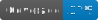

# Project Template

  

    
    
  

---

  

    

      <h3 style="white-space: nowrap; color: #2c3e50;">Build</h3>
      

      

    

    

      <h3 style="white-space: nowrap; color: #2c3e50;">Updates</h3>
      

      

    

    

      <h3 style="white-space: nowrap; color: #2c3e50;">Tests&nbsp;&amp;&nbsp;Coverage</h3>
      

      

      

    

  

---

## Introduction

Welcome to the project template! This README file serves as a starting point for your project. It contains essential information to help you get started.
